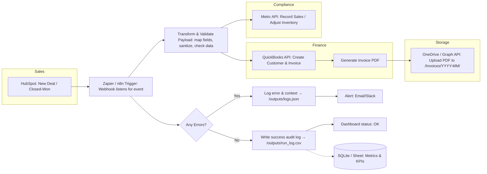

# Cannabis Workflow Automation Sandbox

This repository demonstrates an **end-to-end workflow automation** for cannabis operations.  
The workflow integrates:

- **HubSpot (Sales CRM)**
- **QuickBooks (Finance)**
- **Metrc (Compliance)**
- **OneDrive (Document Storage)**

using **Python, APIs, and automation tools (Zapier/n8n).**

---

## Project Workflow
1. Sales order created in **HubSpot**
2. Invoice auto-generated in **QuickBooks**
3. Invoice PDF stored in **OneDrive**
4. Compliance update logged in **Metrc**

## Workflow Diagram
The diagram below shows the end-to-end automation workflow for cannabis operations, connecting Sales → Finance → Storage → Compliance with observability and optional analytics.

---

## Repository Structure

/src
hubspot_demo.py # Pull HubSpot deals/contacts

quickbooks_demo.py # Create invoice (sandbox or mock)

onedrive_demo.py # Upload invoice file

metrc_demo.py # Compliance update (mock or sandbox)

workflow_pipeline.py # Master script chaining the full workflow

## Features Master Workflow (workflow_pipeline.py)

The `workflow_pipeline.py` script ties everything together:

1. Fetches a new sales order from **HubSpot**
2. Generates an invoice in **QuickBooks**
3. Uploads the invoice file to **OneDrive**
4. Logs a compliance update in **Metrc**

When run, the pipeline prints status messages like:
HubSpot order pulled
Invoice created in QuickBooks
File stored in OneDrive
Compliance update sent to Metrc

This demonstrates how cannabis operations can achieve a **single automated flow** 
from Sales → Finance → Storage → Compliance with minimal manual effort.

